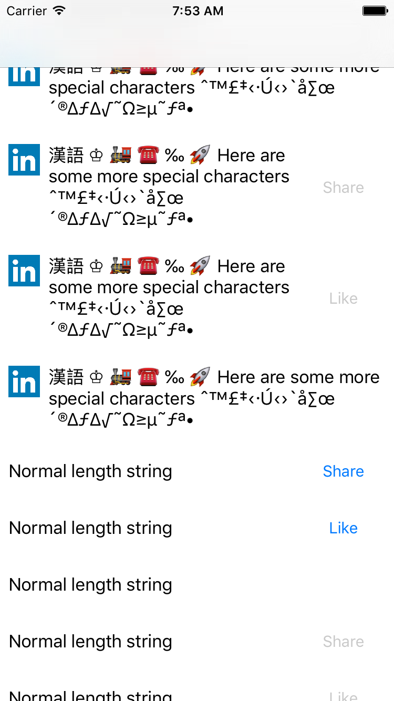

UI Catalog
----------

Since you've already written code to inflate your view with many combinations of data, you can leverage this to create a UICatalog. Basically, you can create a UITableView or UICollectionView of all of your views and inspect them visually. This can help you iterate on APIs fast with fake data and also catch edge cases. It can also be useful to visualize all the edge cases for a view to other members of your team.

.. IMPORTANT::
  Since LayoutTestBase contains references to private APIs (for Autolayout failure detection), you not use UICatalog in your production application. Instead, you should probably create a separate target for the catalog.

For more info, see LYTCatalogTableViewController, LYTCatalogCollectionViewController and LYTViewCatalogProvider. If you run the catalog target in the sample app, you can see an example of what the catalog will provide. It looks something like this:

.. NOTE::
  This part of the library is currently less used and hence less mature and tested than other parts of the library. Please give feedback on the Github page if you find any issues.
